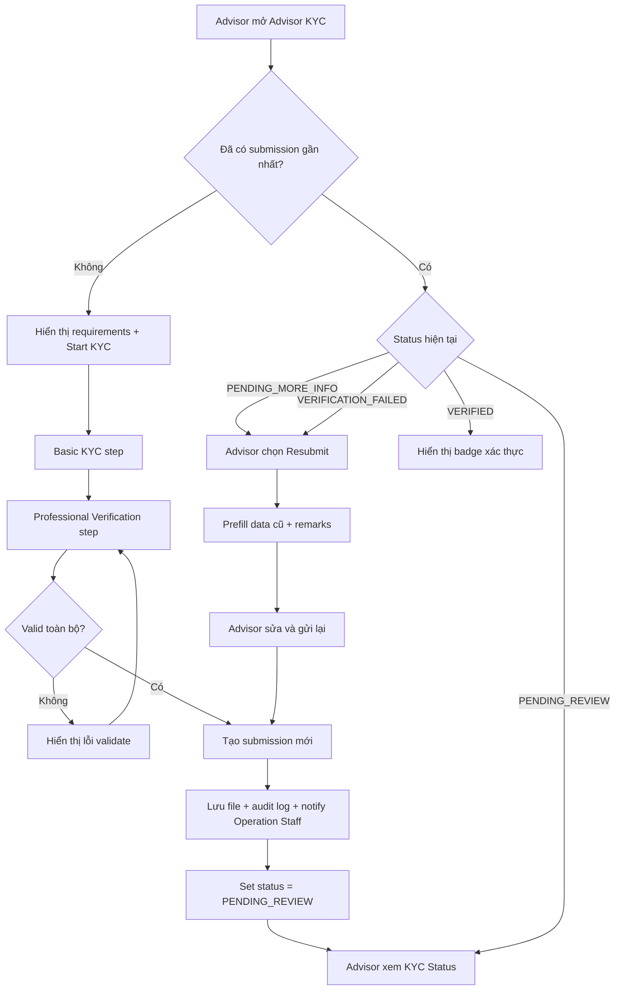
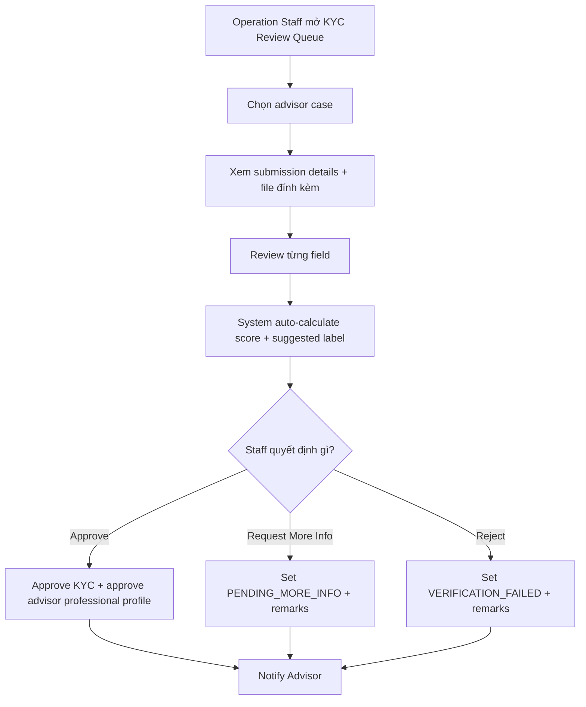
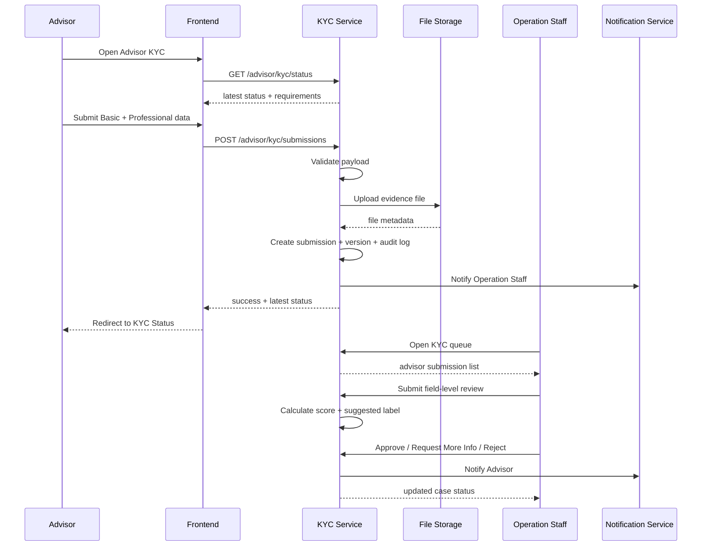

# AISEP - Advisor KYC Implementation Guide

## 1. Mục tiêu tài liệu

Tài liệu này mô tả cách triển khai tính năng **KYC cho role Advisor** trong AISEP theo hướng có thể dùng trực tiếp cho thiết kế backend, frontend và workflow review nội bộ.

Phạm vi chính gồm các use case:

- **UC-100** Verify Advisor identity
- **UC-101** Submit basic KYC verification
- **UC-102** Submit Advisor Professional Verification
- **UC-103** View KYC status
- **UC-104** Resubmit KYC

Ngoài ra, để feature hoạt động đầy đủ, tài liệu này cũng gắn với các use case phía **Operation Staff**:

- View Pending KYC Submissions
- View KYC Submission Details
- Review Advisor Verification Submission
- Record Field-Level Verification Review
- Approve KYC Verification
- Reject KYC Verification
- Request KYC Resubmission
- Approve Advisor professional profile

---

## 2. Nguồn gốc yêu cầu và nguyên tắc triển khai

### 2.1. Những gì tài liệu nguồn xác nhận rõ

Từ SRS hiện tại:

- Advisor có 5 use case KYC chính: verify identity, submit basic KYC, submit professional verification, view status, resubmit.
- Hệ thống có screen **Advisor KYC Status** và **Submit KYC (Advisor)**.
- Quy trình review phía Operation Staff đã có các tác vụ review queue, review case details, record field-level review, approve/reject/request resubmission và approve advisor professional profile.

Từ tài liệu logic nghiệp vụ tiếng Việt:

- Advisor không cần chứng minh là “top expert”, mà chỉ cần xác minh được **danh tính nghề nghiệp** và **chuyên môn cơ bản phù hợp**.
- Hệ thống dùng 4 label cho advisor:
  - `VERIFIED_ADVISOR`
  - `BASIC_VERIFIED`
  - `PENDING_MORE_INFO`
  - `VERIFICATION_FAILED`
- Có bộ field review, hard-fail rule và rule auto-label riêng cho Advisor.

### 2.2. Điểm cần chuẩn hóa thêm khi implement

SRS hiện tại **chưa mô tả chi tiết riêng từng field cho UC-101 và UC-102 của Advisor** như đã làm với Startup/Investor. Vì vậy, tài liệu này đưa ra một phương án triển khai **chuẩn hóa và nhất quán**, bám vào:

- danh sách use case của Advisor,
- screen list của Advisor,
- workflow review của Operation Staff,
- field/rule auto-label trong tài liệu nghiệp vụ.

### 2.3. Hướng chuẩn hóa được chọn

Để logic rõ ràng và dễ code, nên triển khai Advisor KYC thành **1 module** nhưng chia thành **2 logical sections**:

1. **Basic KYC section**
   - xác minh danh tính liên hệ cơ bản của advisor
2. **Professional Verification section**
   - xác minh danh tính nghề nghiệp + chuyên môn cơ bản

Có thể render trên UI theo **1 wizard 2 bước** hoặc **2 form tách riêng**. Đề xuất tốt nhất là **1 wizard 2 bước**, vì:

- khớp với UC-101 và UC-102,
- giảm bỏ dở giữa chừng,
- giúp status dễ hiểu,
- thuận tiện cho resubmit theo từng nhóm field.

---

## 3. Mục tiêu nghiệp vụ của Advisor KYC

Advisor KYC trong AISEP không nhằm chứng minh advisor là chuyên gia hàng đầu, mà nhằm đảm bảo:

- advisor là người thật hoặc có dấu hiệu danh tính hợp lý,
- advisor có profile nghề nghiệp công khai hoặc bằng chứng nghề nghiệp cơ bản,
- lĩnh vực chuyên môn khai báo có mức độ phù hợp tối thiểu,
- startup nhìn thấy một mức xác thực đủ tin cậy trước khi gửi yêu cầu tư vấn.

Kết quả của flow này ảnh hưởng trực tiếp đến:

- khả năng hiển thị badge xác thực trên advisor profile,
- mức độ tin cậy của advisor với startup,
- eligibility cho một số hành vi tư vấn,
- việc Operation Staff có cần yêu cầu bổ sung hồ sơ hay không.

---

## 4. Functional scope chi tiết

## 4.1. Verify Advisor Identity

### Mục đích
Entry point vào module KYC của Advisor.

### Hành vi hệ thống
Khi advisor mở trang KYC:

- kiểm tra quyền truy cập và role,
- lấy KYC status mới nhất,
- quyết định hiển thị một trong các trạng thái:
  - chưa bắt đầu,
  - đang pending review,
  - pending more info,
  - verified,
  - failed,
- quyết định CTA chính:
  - `Start KYC`
  - `Continue KYC`
  - `View Status`
  - `Resubmit`

### Gợi ý UI
- status badge
- mô tả ngắn về ý nghĩa badge
- checklist yêu cầu hồ sơ
- nút bắt đầu / tiếp tục / xem kết quả

---

## 4.2. Submit Basic KYC Verification

### Mục đích
Thu thập dữ liệu danh tính liên hệ cơ bản của advisor.

### Đề xuất field cho Basic KYC

- `fullName`
- `contactEmail`
- `declarationAccepted`

### Optional nhưng nên hỗ trợ prefill nếu đã có profile

- `currentRoleTitle`
- `currentOrganization`
- `professionalProfileLink`

### Validation

- user phải authenticated
- role phải là `ADVISOR`
- không được có case đang `PENDING_REVIEW` chưa xử lý xong
- `fullName` bắt buộc
- `contactEmail` bắt buộc, đúng format email
- `declarationAccepted` phải bằng `true`

### Kết quả lưu trữ

- tạo hoặc cập nhật draft/basic section
- chưa kết luận label ở bước này
- chuyển user sang Professional Verification step

---

## 4.3. Submit Advisor Professional Verification

### Mục đích
Thu thập và gửi phần bằng chứng nghề nghiệp/chuyên môn để review.

### Field nguồn chuẩn hóa từ tài liệu nghiệp vụ

- `fullName`
- `currentRoleTitle`
- `currentOrganization`
- `primaryExpertise`
- `secondaryExpertise[]`
- `contactEmail`
- `professionalProfileLink`
- `basicExpertiseProofFile`
- `declarationAccepted`

### Allowed values cho `primaryExpertise`

- `FUNDRAISING`
- `PRODUCT_STRATEGY`
- `GO_TO_MARKET`
- `FINANCE`
- `LEGAL_IP`
- `OPERATIONS`
- `TECHNOLOGY`
- `MARKETING`
- `HR_OR_TEAM_BUILDING`

### Validation

- user phải authenticated
- role phải là `ADVISOR`
- advisor phải được phép submit KYC
- `fullName` bắt buộc
- `currentRoleTitle` bắt buộc
- `currentOrganization` bắt buộc
- `primaryExpertise` bắt buộc
- `contactEmail` bắt buộc và hợp lệ
- `professionalProfileLink` bắt buộc và đúng URL format
- `basicExpertiseProofFile` bắt buộc
- `declarationAccepted` phải bằng `true`
- file phải đúng policy về extension, MIME type, size

### Kết quả xử lý khi submit thành công

- tạo mới một `kyc_submission`
- lưu snapshot tất cả field đã submit
- lưu file vào object storage
- gán `workflowStatus = PENDING_REVIEW`
- tạo audit log
- gửi notification cho Operation Staff
- redirect sang màn `Advisor KYC Status`

---

## 4.4. View KYC Status

### Mục đích
Cho advisor theo dõi tiến độ review và biết bước tiếp theo.

### Dữ liệu cần hiển thị

- `workflowStatus`
- `verificationLabel`
- thời gian submit gần nhất
- summary field đã gửi
- review remarks tổng quát
- danh sách field bị yêu cầu bổ sung
- lịch sử các lần submit/resubmit
- CTA tương ứng với trạng thái

### Các trạng thái hiển thị nên hỗ trợ

#### 1. `NOT_STARTED`
- chưa có submission nào
- CTA: `Start KYC`

#### 2. `DRAFT`
- đang điền dở
- CTA: `Continue KYC`

#### 3. `PENDING_REVIEW`
- staff chưa chốt kết quả
- CTA: chỉ xem status

#### 4. `PENDING_MORE_INFO`
- cần bổ sung thêm dữ liệu / file
- CTA: `Resubmit`
- hiển thị các field cần sửa hoặc bổ sung

#### 5. `VERIFIED`
- workflow đã pass
- `verificationLabel` có thể là:
  - `VERIFIED_ADVISOR`
  - `BASIC_VERIFIED`
- CTA: `View Details`

#### 6. `VERIFICATION_FAILED`
- hồ sơ không đạt
- CTA: `Resubmit` nếu policy cho phép

---

## 4.5. Resubmit KYC

### Mục đích
Cho advisor chỉnh sửa và gửi lại hồ sơ sau khi bị fail hoặc bị yêu cầu bổ sung.

### Điều kiện được resubmit

Chỉ cho phép resubmit nếu `workflowStatus` thuộc một trong các trạng thái:

- `PENDING_MORE_INFO`
- `VERIFICATION_FAILED` và policy cho phép gửi lại

### Hành vi hệ thống

- load submission gần nhất
- prefill những field được phép chỉnh sửa
- hiển thị review remarks cũ
- highlight các field cần sửa
- cho upload file thay thế nếu cần
- tạo **submission version mới**, không ghi đè hoàn toàn bản cũ
- set lại `workflowStatus = PENDING_REVIEW`
- ghi audit log
- notify Operation Staff

### Lưu ý quan trọng
Resubmit nên là **version mới** thay vì update cứng vào bản cũ, để:

- giữ lịch sử review,
- so sánh trước/sau,
- thuận tiện audit,
- tránh mất trace khi staff đã review field-level.

---

## 5. Luồng hoạt động end-to-end

## 5.1. Luồng chính phía Advisor



## 5.2. Luồng review phía Operation Staff



## 5.3. Sequence flow đề xuất



---

## 6. Domain model đề xuất

## 6.1. Entity chính

### `advisor_kyc_submission`

```text
id
advisor_id
submission_no
version_no
workflow_status
verification_label
auto_score
auto_label_suggestion
review_decision_by
review_decision_at
submitted_at
resubmitted_from_submission_id
latest_remark
created_at
updated_at
```

### `advisor_kyc_snapshot`

Lưu snapshot dữ liệu business tại thời điểm submit.

```text
id
submission_id
full_name
current_role_title
current_organization
primary_expertise
secondary_expertise_json
contact_email
professional_profile_link
proof_file_id
declaration_accepted
```

### `advisor_kyc_file`

```text
id
submission_id
file_category
storage_key
original_name
mime_type
size_bytes
checksum
uploaded_at
```

### `advisor_kyc_field_review`

```text
id
submission_id
field_code
review_value
review_score
review_comment
reviewed_by
reviewed_at
```

### `advisor_kyc_status_history`

```text
id
submission_id
from_status
to_status
action
remark
changed_by
changed_at
```

---

## 6.2. Enum đề xuất

### `workflow_status`

```text
NOT_STARTED
DRAFT
PENDING_REVIEW
PENDING_MORE_INFO
VERIFIED
VERIFICATION_FAILED
```

### `verification_label`

```text
VERIFIED_ADVISOR
BASIC_VERIFIED
PENDING_MORE_INFO
VERIFICATION_FAILED
```

### `field_code`

```text
FULL_NAME
CURRENT_ROLE_TITLE
CURRENT_ORGANIZATION
PRIMARY_EXPERTISE
SECONDARY_EXPERTISE
CONTACT_EMAIL
PROFESSIONAL_PROFILE_LINK
BASIC_EXPERTISE_PROOF_FILE
DECLARATION
```

---

## 7. Review logic cho Operation Staff

## 7.1. Reviewed values theo tài liệu nghiệp vụ

### `FULL_NAME`
- `STRONG_LINK`
- `PLAUSIBLE_LINK`
- `CANNOT_VERIFY`
- `SUSPICIOUS`

### `CURRENT_ROLE_TITLE`
- `CLEAR_AND_RELEVANT`
- `BASIC_BUT_WEAK`
- `UNCLEAR`
- `NOT_RELEVANT`

### `CURRENT_ORGANIZATION`
- `ACTIVE_AND_MATCH`
- `PLAUSIBLE`
- `CANNOT_VERIFY`
- `NOT_RELATED`

### `PRIMARY_EXPERTISE`
- `CLEAR_MATCH`
- `PARTIAL_MATCH`
- `UNCLEAR`
- `MISMATCH`

### `SECONDARY_EXPERTISE`
- `CLEAR_MATCH`
- `PARTIAL_MATCH`
- `NOT_ENOUGH_INFO`
- `MISMATCH`

### `CONTACT_EMAIL`
- `ALIGNED`
- `PERSONAL_BUT_PLAUSIBLE`
- `UNRELATED`
- `INVALID`

### `PROFESSIONAL_PROFILE_LINK`
- `ACTIVE_AND_MATCH`
- `ACTIVE_BUT_WEAK`
- `INACTIVE_OR_BROKEN`
- `NOT_RELATED`

### `BASIC_EXPERTISE_PROOF_FILE`
- `CLEAR_AND_RELEVANT`
- `BASIC_BUT_WEAK`
- `UNCLEAR`
- `IRRELEVANT_OR_SUSPICIOUS`

### `DECLARATION`
- `ACCEPTED`
- `MISSING`

---

## 7.2. Quy đổi điểm

Để nhất quán với logic hiện có trong dự án:

- nhóm tốt = `2 điểm`
- nhóm chấp nhận được = `1 điểm`
- nhóm chưa đủ cơ sở = `0 điểm`
- nhóm fail/rủi ro = `-2 điểm`

### Mapping score đề xuất

```text
FULL_NAME
- STRONG_LINK = 2
- PLAUSIBLE_LINK = 1
- CANNOT_VERIFY = 0
- SUSPICIOUS = -2

CURRENT_ROLE_TITLE
- CLEAR_AND_RELEVANT = 2
- BASIC_BUT_WEAK = 1
- UNCLEAR = 0
- NOT_RELEVANT = -2

CURRENT_ORGANIZATION
- ACTIVE_AND_MATCH = 2
- PLAUSIBLE = 1
- CANNOT_VERIFY = 0
- NOT_RELATED = -2

PRIMARY_EXPERTISE
- CLEAR_MATCH = 2
- PARTIAL_MATCH = 1
- UNCLEAR = 0
- MISMATCH = -2

SECONDARY_EXPERTISE
- CLEAR_MATCH = 2
- PARTIAL_MATCH = 1
- NOT_ENOUGH_INFO = 0
- MISMATCH = -2

CONTACT_EMAIL
- ALIGNED = 2
- PERSONAL_BUT_PLAUSIBLE = 1
- UNRELATED = 0
- INVALID = -2

PROFESSIONAL_PROFILE_LINK
- ACTIVE_AND_MATCH = 2
- ACTIVE_BUT_WEAK = 1
- INACTIVE_OR_BROKEN = 0
- NOT_RELATED = -2

BASIC_EXPERTISE_PROOF_FILE
- CLEAR_AND_RELEVANT = 2
- BASIC_BUT_WEAK = 1
- UNCLEAR = 0
- IRRELEVANT_OR_SUSPICIOUS = -2

DECLARATION
- ACCEPTED = 2
- MISSING = -2
```

---

## 7.3. Hard fail rules

Gán ngay `VERIFICATION_FAILED` nếu có ít nhất một điều kiện sau:

- `FULL_NAME = SUSPICIOUS`
- `PRIMARY_EXPERTISE = MISMATCH`
- `PROFESSIONAL_PROFILE_LINK = NOT_RELATED`
- `BASIC_EXPERTISE_PROOF_FILE = IRRELEVANT_OR_SUSPICIOUS`

---

## 7.4. Auto-label logic

Nếu **không hard fail**, tính tổng điểm 9 field review.

### `VERIFIED_ADVISOR`
Điều kiện:

- tổng điểm `>= 11`
- và đồng thời:
  - `PRIMARY_EXPERTISE` là `CLEAR_MATCH` hoặc `PARTIAL_MATCH`
  - `PROFESSIONAL_PROFILE_LINK` là `ACTIVE_AND_MATCH` hoặc `ACTIVE_BUT_WEAK`
  - `BASIC_EXPERTISE_PROOF_FILE` là `CLEAR_AND_RELEVANT` hoặc `BASIC_BUT_WEAK`

### `BASIC_VERIFIED`
- tổng điểm từ `7` đến `10`

### `PENDING_MORE_INFO`
- tổng điểm từ `3` đến `6`

### `VERIFICATION_FAILED`
- tổng điểm `<= 2`
- hoặc có hard fail

---

## 7.5. Quy tắc phê duyệt cuối cùng

### Đề xuất rõ ràng để code

- `auto_label_suggestion` do hệ thống tính từ field review
- `final_label` do Operation Staff xác nhận khi chốt case
- mặc định `final_label = auto_label_suggestion`
- chỉ cho phép staff override nếu có `override_reason`
- mọi override phải ghi audit log

Việc này giúp:

- giữ tính nhất quán,
- tránh review cảm tính,
- nhưng vẫn cho staff quyền xử lý ngoại lệ.

---

## 8. Decision matrix giữa workflow status và label

| Tình huống | workflow_status | verification_label |
|---|---|---|
| Chưa từng submit | NOT_STARTED | null |
| Đang điền dở | DRAFT | null |
| Đã gửi, chờ staff review | PENDING_REVIEW | null hoặc label cũ giữ nguyên |
| Staff yêu cầu bổ sung | PENDING_MORE_INFO | PENDING_MORE_INFO |
| Staff approve ở mức tốt | VERIFIED | VERIFIED_ADVISOR |
| Staff approve ở mức cơ bản | VERIFIED | BASIC_VERIFIED |
| Staff reject | VERIFICATION_FAILED | VERIFICATION_FAILED |

> Lưu ý: `workflow_status` là trạng thái luồng xử lý, còn `verification_label` là kết quả xác thực hiển thị cho business/UI. Hai giá trị này không nên trộn làm một.

---

## 9. Frontend flow đề xuất

## 9.1. Màn hình 1 - Advisor KYC Landing / Status

### Hiển thị
- status badge
- mô tả ý nghĩa status
- checklist hồ sơ cần chuẩn bị
- nút `Start KYC`, `Continue`, `Resubmit`, hoặc `View Details`

### CTA rules
- `NOT_STARTED` -> `Start KYC`
- `DRAFT` -> `Continue KYC`
- `PENDING_REVIEW` -> không cho submit mới
- `PENDING_MORE_INFO` -> `Resubmit`
- `VERIFIED` -> `View Details`
- `VERIFICATION_FAILED` -> `Resubmit` nếu được phép

---

## 9.2. Màn hình 2 - Basic KYC Step

### Section
- full name
- contact email
- declaration checkbox

### Action
- `Save Draft`
- `Continue`

---

## 9.3. Màn hình 3 - Professional Verification Step

### Section
- current role/title
- current organization
- primary expertise
- secondary expertise
- professional profile link
- proof file upload

### Action
- `Back`
- `Save Draft`
- `Submit`

---

## 9.4. Màn hình 4 - KYC Status Details

### Section
- latest submission summary
- status timeline
- final label
- remarks from staff
- fields requiring update
- resubmit CTA if allowed

---

## 9.5. Màn hình 5 - Resubmit Form

### Section
- prefilled previous data
- badges/highlight cho field cần sửa
- re-upload input
- remarks từ staff
- submit again CTA

---

## 10. Backend API đề xuất

## 10.1. Advisor side

### `GET /api/advisor/kyc/status`
Trả về trạng thái KYC mới nhất.

### `GET /api/advisor/kyc/requirements`
Trả về checklist requirement và file policy.

### `POST /api/advisor/kyc/draft`
Lưu draft khi user đang nhập dở.

### `POST /api/advisor/kyc/submissions`
Tạo submission mới.

### `POST /api/advisor/kyc/resubmissions`
Tạo resubmission version mới.

### `GET /api/advisor/kyc/submissions/{submissionId}`
Xem chi tiết submission.

### `GET /api/advisor/kyc/history`
Lịch sử các lần submit/resubmit.

---

## 10.2. Operation Staff side

### `GET /api/operation/kyc/queue?role=advisor`
Danh sách advisor KYC đang chờ review.

### `GET /api/operation/kyc/cases/{submissionId}`
Chi tiết case review.

### `POST /api/operation/kyc/cases/{submissionId}/field-reviews`
Lưu field-level review.

### `POST /api/operation/kyc/cases/{submissionId}/request-more-info`
Chuyển case sang `PENDING_MORE_INFO`.

### `POST /api/operation/kyc/cases/{submissionId}/approve`
Approve KYC và set label cuối cùng.

### `POST /api/operation/kyc/cases/{submissionId}/reject`
Reject KYC.

---

## 11. Validation rules chi tiết

## 11.1. Client-side

- required field check
- email format
- URL format
- file extension
- file size
- declaration checkbox
- giới hạn số lượng lựa chọn secondary expertise

## 11.2. Server-side

- xác thực session và role
- check duplicate active pending case
- validate enum values
- validate ownership của submission
- validate file metadata thật sự từ backend
- chống sửa payload trái phép
- chống resubmit khi status không hợp lệ

## 11.3. Duplicate submission policy

Đề xuất policy:

- nếu đang có case `PENDING_REVIEW`, không cho tạo submission mới
- nếu đang `DRAFT`, update draft hiện tại thay vì tạo draft khác
- resubmit phải tạo **version mới** gắn với submission gần nhất

---

## 12. Notification logic

## 12.1. Notify Operation Staff khi advisor submit/resubmit

Trigger:
- advisor submit mới
- advisor resubmit

Payload nên có:
- advisor name
- submission id
- submitted at
- role = advisor
- urgency flag nếu đã resubmit nhiều lần

## 12.2. Notify Advisor khi review xong

Trigger:
- approved
- request more info
- rejected

Payload nên có:
- final status
- final label
- short remarks
- CTA link về màn status

---

## 13. Audit log bắt buộc

Phải ghi audit log cho các hành vi sau:

- tạo draft KYC
- submit KYC
- resubmit KYC
- upload / replace proof file
- Operation Staff review field
- auto-score calculation
- approve / reject / request more info
- label override

### Audit fields tối thiểu

```text
actor_id
actor_role
action
entity_type
entity_id
old_value_json
new_value_json
ip_address
user_agent
created_at
```

---

## 14. Error handling và message behavior

Tài liệu SRS hiện đang dùng nhóm message chung như `MSG001`, `MSG002`, `MSG004`, `MSG005`, `MSG006`, `MSG008`.

Đề xuất map hành vi như sau:

- `MSG001`: thao tác thành công
- `MSG002`: dữ liệu nhập không hợp lệ / thiếu required field
- `MSG004`: file hoặc format vi phạm policy
- `MSG005`: user không đủ điều kiện thực hiện hành động hoặc state không hợp lệ
- `MSG006`: chưa có dữ liệu
- `MSG008`: lỗi xử lý hệ thống

---

## 15. Edge cases cần xử lý

## 15.1. Advisor đang verified nhưng sửa profile

Nếu advisor đã verified rồi và cập nhật các field nhạy cảm như:

- full name
- current role/title
- current organization
- primary expertise
- professional profile link

thì nên có 2 lựa chọn policy:

### Policy khuyến nghị
- profile update vẫn lưu được,
- nhưng nếu field nhạy cảm thay đổi, tạo cờ `reverification_required = true`,
- badge hiện tại có thể bị hạ về trạng thái cần review lại nếu business muốn chặt.

## 15.2. File proof bị xóa hoặc inaccessible

- không cho approve nếu file review bắt buộc không mở được
- staff có thể request more info

## 15.3. Link professional profile chết sau khi đã verified

- không tự downgrade ngay lập tức
- chỉ đánh dấu cho periodic re-check hoặc manual review queue

## 15.4. Advisor gửi nhiều lần liên tiếp

- chặn spam submit
- có cooldown ngắn ở frontend
- backend idempotency key nếu cần

## 15.5. Staff review dở dang

- cho phép lưu field review nháp
- chỉ chốt status khi staff bấm approve/reject/request more info

---

## 16. Acceptance criteria đề xuất

## 16.1. Submit flow
- Advisor có thể mở KYC module và thấy CTA đúng theo trạng thái.
- Advisor submit đủ dữ liệu và file thì hệ thống tạo case `PENDING_REVIEW`.
- Nếu thiếu required field hoặc file sai policy thì bị chặn.
- Sau submit thành công, advisor được redirect về status screen.

## 16.2. Review flow
- Operation Staff thấy case trong queue.
- Staff có thể review từng field.
- Hệ thống tự tính score và suggested label.
- Staff có thể approve, reject, hoặc request more info.
- Advisor nhận notification sau khi case được xử lý.

## 16.3. Resubmit flow
- Advisor chỉ resubmit được khi status cho phép.
- Resubmit tạo version mới.
- History vẫn giữ nguyên các bản cũ.
- Staff nhìn được remarks cũ và submission mới.

---

## 17. Pseudocode auto-label

```ts
function calculateAdvisorKycDecision(review: AdvisorFieldReviewMap) {
  const hardFail =
    review.FULL_NAME === 'SUSPICIOUS' ||
    review.PRIMARY_EXPERTISE === 'MISMATCH' ||
    review.PROFESSIONAL_PROFILE_LINK === 'NOT_RELATED' ||
    review.BASIC_EXPERTISE_PROOF_FILE === 'IRRELEVANT_OR_SUSPICIOUS';

  if (hardFail) {
    return {
      score: sumScores(review),
      label: 'VERIFICATION_FAILED',
      workflowStatus: 'VERIFICATION_FAILED',
    };
  }

  const score = sumScores(review);

  const qualifiesVerifiedAdvisor =
    score >= 11 &&
    ['CLEAR_MATCH', 'PARTIAL_MATCH'].includes(review.PRIMARY_EXPERTISE) &&
    ['ACTIVE_AND_MATCH', 'ACTIVE_BUT_WEAK'].includes(review.PROFESSIONAL_PROFILE_LINK) &&
    ['CLEAR_AND_RELEVANT', 'BASIC_BUT_WEAK'].includes(review.BASIC_EXPERTISE_PROOF_FILE);

  if (qualifiesVerifiedAdvisor) {
    return {
      score,
      label: 'VERIFIED_ADVISOR',
      workflowStatus: 'VERIFIED',
    };
  }

  if (score >= 7) {
    return {
      score,
      label: 'BASIC_VERIFIED',
      workflowStatus: 'VERIFIED',
    };
  }

  if (score >= 3) {
    return {
      score,
      label: 'PENDING_MORE_INFO',
      workflowStatus: 'PENDING_MORE_INFO',
    };
  }

  return {
    score,
    label: 'VERIFICATION_FAILED',
    workflowStatus: 'VERIFICATION_FAILED',
  };
}
```

---

## 18. Khuyến nghị triển khai thực tế

## 18.1. Nên làm phase 1 như sau

- 1 wizard 2 bước cho advisor submit
- 1 status screen
- 1 operation review case screen
- 1 file upload proof duy nhất cho phase đầu
- field-level review + auto-label + manual final decision

## 18.2. Chưa cần làm ngay ở phase 1

- periodic automatic reverification
- nhiều loại proof file phức tạp
- OCR/external profile crawling tự động
- AI hỗ trợ review hồ sơ advisor

## 18.3. Kiến trúc gợi ý

- `advisor-kyc` module riêng ở backend
- `review-engine` dùng chung cho startup/investor/advisor nếu muốn tái sử dụng
- `storage-service` tách riêng cho file evidence
- `notification-service` bắn event sau submit/review

---

## 19. Kết luận

Giải pháp triển khai phù hợp nhất cho AISEP là:

- coi Advisor KYC là **1 module xác thực nghề nghiệp cơ bản**,
- chia thành **Basic KYC + Professional Verification**,
- dùng **field-level review** phía Operation Staff,
- dùng **auto-score + auto-label** để chuẩn hóa quyết định,
- nhưng vẫn cho phép **staff chốt kết quả cuối cùng có audit trail**,
- lưu **version history** cho mọi lần resubmit.

Thiết kế này vừa bám tài liệu hiện có, vừa đủ rõ để code frontend, backend, database và workflow review một cách nhất quán.
